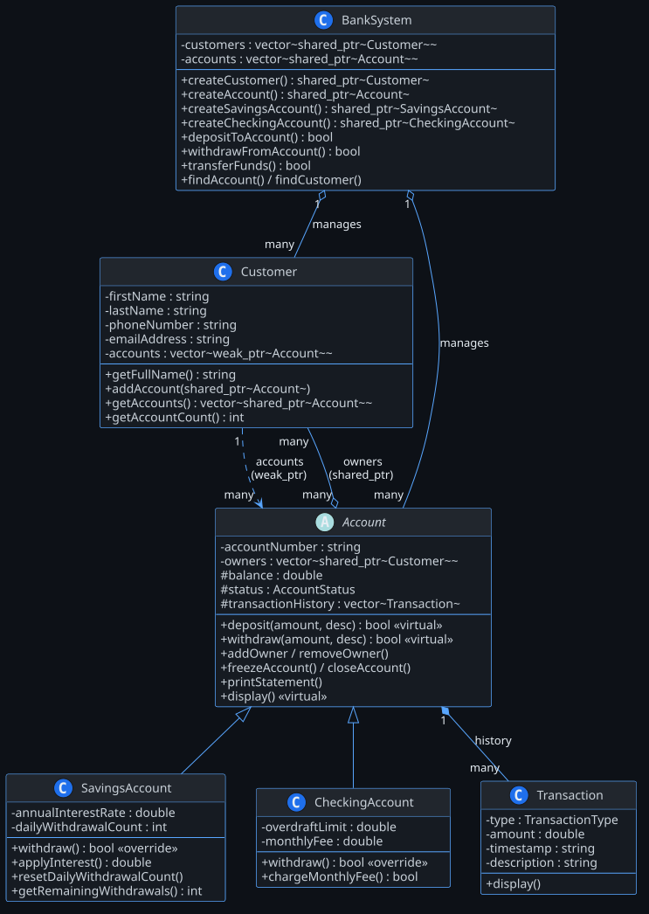

# Mini Bank System

Konsolowo-graficzny symulator systemu bankowego napisany w C++17 z opcjonalnym interfejsem Qt6.

---

## Wymagania

- CMake ≥ 3.16
- Kompilator zgodny z C++17 (GCC 11+, Clang 13+, MSVC 2022+)
- Qt6 (moduł `Widgets`) - wymagany tylko do buildu z GUI

---

## Budowanie

```bash
git clone https://github.com/kacper-blaze/mini-bank-system.git
cd mini-bank-system

cmake -B build -DCMAKE_BUILD_TYPE=Release
cmake --build build
```

Po udanym buildzie w katalogu `build/` pojawią się dwa pliki wykonywalne:

| Plik                      | Opis                          |
|---------------------------|-------------------------------|
| `mini_bank_system`        | Główna aplikacja              |
| `mini_bank_system_tests`  | Zestaw testów jednostkowych   |

### Uruchomienie

```bash
# Tryb konsolowy (domyślny)
./build/mini_bank_system

# Tryb graficzny (Qt)
./build/mini_bank_system --gui

# Testy
./build/mini_bank_system_tests
```

---

## Struktura projektu

```
mini-bank-system/
├── include/
│   ├── Account.hpp          # Klasa bazowa konta
│   ├── SavingsAccount.hpp   # Konto oszczędnościowe
│   ├── CheckingAccount.hpp  # Konto rozliczeniowe (z debetem)
│   ├── BankSystem.hpp       # Centralny rejestr klientów i kont
│   ├── Customer.hpp         # Dane klienta + lista jego kont
│   ├── Transaction.hpp      # Pojedyncza operacja finansowa
│   ├── Logger.hpp           # Zapis audytu do pliku
│   └── Utils.hpp            # Pomocnicze (timestamp, formatowanie)
├── src/                     # Implementacje (.cpp)
├── gui/
│   ├── MainWindow.hpp
│   └── MainWindow.cpp       # Interfejs Qt6
├── tests/
│   ├── AccountTests.hpp
│   ├── BankSystemTests.hpp
│   ├── SavingsAccountTests.hpp
│   ├── CheckingAccountTests.hpp
│   └── RunTests.cpp
└── CMakeLists.txt
```


## Typy kont

### Konto podstawowe (`Account`)
Standardowe konto bez dodatkowych ograniczeń. Saldo nie może zejść poniżej 0.

### Konto oszczędnościowe (`SavingsAccount`)
- Oprocentowanie naliczane przez `applyInterest()` - miesięczna rata z rocznej stopy (domyślnie 4% p.a.)
- Maksymalnie **3 wypłaty dziennie** - po przekroczeniu operacja jest blokowana
- `resetDailyWithdrawalCount()` - reset licznika (wywoływać raz na dobę)
- Brak debetu

### Konto rozliczeniowe (`CheckingAccount`)
- Dozwolony debet do **-500 zł** (konfigurowalny)
- Miesięczna opłata za prowadzenie konta przez `chargeMonthlyFee()` (domyślnie 9.99 zł)
- Opłata pobierana jest nawet przy ujemnym saldzie, o ile nie przekracza limitu debetu

---

## Interfejs konsolowy

```
==== MINI BANK SYSTEM ====
1. Create New Customer
2. Open Account for Existing Customer
3. Deposit Funds
4. Withdraw Funds
5. Transfer Money
6. Display All Accounts
7. Display Customer Accounts
8. Exit
```

Opcja 2 pozwala otworzyć kolejne konto dla już zarejestrowanego klienta - jeden klient może mieć dowolną liczbę kont różnych typów.

---

## Interfejs graficzny (Qt)

```
┌─────────────────────────────────────────────────────────────┐
│  New Account               │  Operations                    │
│  ┌──────────────────────┐  │  ┌──────────────────────────┐  │
│  │ First Name           │  │  │ Account Number           │  │
│  │ Last Name            │  │  │ To Account (transfer)    │  │
│  │ Phone                │  │  │ Amount                   │  │
│  │ Email                │  │  │                          │  │
│  │ [Basic ▼]            │  │  │ [Deposit][Withdraw]      │  │
│  │ [Create Account]     │  │  │ [Transfer]               │  │
│  └──────────────────────┘  │  └──────────────────────────┘  │
├─────────────────────────────────────────────────────────────┤
│  Accounts                                      [Refresh]    │
│  ┌──────────┬──────────┬─────────────┬──────────┬────────┐  │
│  │ Account# │ Type     │ Owner(s)    │ Balance  │ Status │  │
│  ├──────────┼──────────┼─────────────┼──────────┼────────┤  │
│  │ BNK-1    │ Savings  │ Anna Kow.   │ $2000.00 │ Active │  │
│  │ BNK-2    │ Checking │ Anna Kow.   │  -$12.50 │ Active │  │ ← saldo ujemne wyświetlane na czerwono
│  └──────────┴──────────┴─────────────┴──────────┴────────┘  │
├─────────────────────────────────────────────────────────────┤
│  Activity Log                                               │
│  > Account created: BNK-1 [Savings]                         │
│  > Deposited $2000.00 → BNK-1                               │
│  > Withdrawal FAILED for BNK-2 (limit reached)              │
└─────────────────────────────────────────────────────────────┘
```

Jeśli klient o podanym imieniu i nazwisku już istnieje w systemie, formularz otworzy mu nowe konto zamiast tworzyć duplikat.

---
## Architektura

---

## Zapis audytu

Wszystkie operacje są zapisywane do pliku `bank_audit.log` w katalogu roboczym:

```
[2025-05-30 14:22:01] SYSTEM: Registered new customer: Anna Kowalska
[2025-05-30 14:22:01] SYSTEM: Created account BNK-1 [Savings] for Anna Kowalska
[2025-05-30 14:22:05] TX SUCCESS: Deposited $2000.000000 into BNK-1
[2025-05-30 14:22:10] TX FAILED: Withdrawal from BNK-1 failed.
```

---

## Znane ograniczenia

- Dane są przechowywane wyłącznie w pamięci - po zamknięciu programu wszystko ginie
- Typ `double` do przechowywania kwot - przy intensywnym użytkowaniu mogą wystąpić błędy zaokrągleń (docelowo: arytmetyka na groszach jako `int`)
- `resetDailyWithdrawalCount()` w `SavingsAccount` trzeba wywoływać ręcznie - brak wbudowanego schedulera

---

## Komendy Git użyte w projekcie

Poniżej znajduje się zestaw podstawowych komend linii poleceń systemu Git, które zostały wykorzystane do inicjalizacji, rozwoju oraz zachowania plików w repozytorium:

```bash
# Inicjalizacja nowego repozytorium lokalnego
git init

# Sprawdzenie statusu plików
git status

# Dodanie wszystkich zmian do obszaru przejściowego (staging)
git add .

# Zatwierdzenie zmian z krótkim opisem
git commit -m "treść commita"

# Podpięcie zdalnego repozytorium GitHub
git remote add origin <link>

# Wypchnięcie zmian na serwer do gałęzi głównej
git push -u origin main

# Podejrzenie historii commitów
git log --oneline